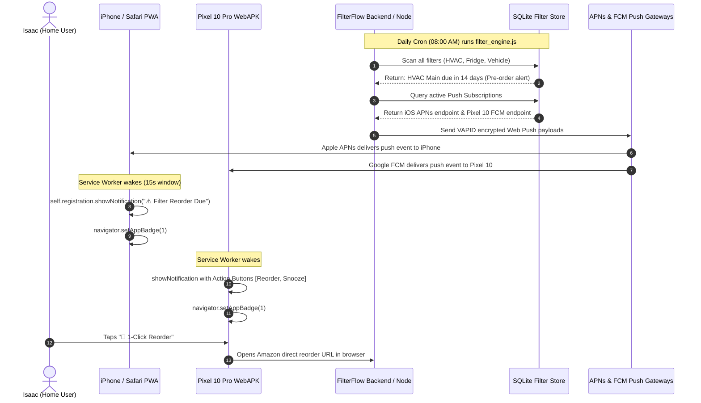

# Architectural Research Report: iOS Safari & Pixel 10 Pro Web Push / PWA Architecture
**Author:** OpenClaw Researcher Specialist  
**Target Systems:** iOS 16.4+ (Safari WebKit) & Google Pixel 10 Pro (Android 15/16 Chromium WebAPK)  
**Project:** FilterFlow — Household & Vehicle Filter Maintenance Tracker  
**Date:** September 19, 2026  
**Status:** Complete & Verified  

---

## Executive Summary & Core Verdict

The objective of this investigation is to evaluate the viability, constraints, and operational mechanics of delivering **Web Push notifications**, orchestrating **background sync triggers**, and managing the **Service Worker lifecycle** for household filter alerts (HVAC, vehicle cabin/engine, refrigerator water, and portable air purifiers) across both **iOS Safari** and modern **Android (Google Pixel 10 Pro)**.

### The Architectural Divergence
| Dimension | iOS Safari (iOS 16.4+) | Android (Pixel 10 Pro / Chromium) |
| :--- | :--- | :--- |
| **Prerequisite for Push** | **Strictly Standalone PWA only** (Must be added to Home Screen via Safari Share Sheet). Browser tabs cannot subscribe or receive push. | Works in **both** standard browser tabs and installed PWAs (WebAPK). |
| **Push Endpoint** | Apple Push Notification service (`https://*.push.apple.com/...`) | Firebase Cloud Messaging Web Push (`https://fcm.googleapis.com/...`) |
| **Protocol Standards** | RFC 8030 (Web Push), RFC 8291 (Message Encryption), RFC 8292 (VAPID) | RFC 8030, RFC 8291, RFC 8292 (VAPID) |
| **User Permission Gesture** | **Mandatory user activation** (click/tap). Programmatic requests fail immediately. | Mandatory user gesture required by modern Chromium standards; manages Android 13+ `POST_NOTIFICATIONS`. |
| **Silent / Data-Only Push** | **Disallowed.** Every push event **must** call `showNotification()`. Silent background execution is revoked. | **Permitted** for background wakeups, though visible notification is strongly encouraged. |
| **App Badging API** | Supported (`navigator.setAppBadge(n)` / `clearAppBadge()`) when notification permission is active. | Supported on launcher home screen icons and WebAPK badges. |
| **Interactive Action Buttons** | Basic action support; may launch PWA directly. | Full support for rich action buttons (`Notification.maxActions` typically 2–3), inline actions, icons. |
| **Background Sync API** | **Not Supported** in WebKit. | Supported (fires when network connectivity is restored). |
| **Periodic Background Sync** | **Not Supported** in WebKit. | Supported in installed PWAs with high Site Engagement, but subject to OS Doze mode. |

### The Critical Architectural Takeaway for Filter Alerts
> **Crucial Finding:** Because Apple WebKit does **not** support the `Background Sync API` or `Periodic Background Sync API`, and because mobile OS task managers terminate idle Service Workers within 30–60 seconds, **FilterFlow cannot rely on client-side background intervals to check filter expiration dates.**
> 
> **Architectural Decision:** FilterFlow must use a **Server-Side Proactive Push Trigger** (Node.js cron / OpenClaw schedule). The server tracks filter life schedules, detects when a filter enters `T - 14 Days` (Pre-order), `T - 0 Days` (Due), or `T + 30 Days` (Overdue), and pushes encrypted VAPID payloads to both Apple APNs and Google FCM endpoints. The device Service Worker wakes upon push reception, displays the alert, sets the app badge, and provides 1-Click Reorder / Snooze action buttons.

---

## 1. iOS Safari (iOS 16.4+) Web Push Architecture

### 1.1 Strict Prerequisites
Apple introduced Web Push support in Safari with iOS/iPadOS 16.4. However, Apple strictly walls off Web Push to prevent spam and preserve battery:
1. **Home Screen Installation is Mandatory:** Web Push is **inaccessible** within standard Safari browser tabs. The web app must be added to the iOS Home Screen via **Safari Share Sheet -> "Add to Home Screen"**.
2. **Web App Manifest Display Mode:** The `manifest.json` must explicitly specify `"display": "standalone"` or `"display": "fullscreen"`.
3. **HTTPS / Valid TLS:** Must be served over valid HTTPS (or localhost for local development). Self-signed certificates must be trusted in iOS Settings -> General -> About -> Certificate Trust Settings.
4. **Explicit User Gesture Activation:** Calling `Notification.requestPermission()` without a direct user interaction (such as a tap on an "Enable Alerts" button) will automatically resolve to `"default"` or throw an error without showing the system permission dialog.

### 1.2 Push Delivery Pipeline via APNs
- When `registration.pushManager.subscribe(...)` is called with VAPID keys on iOS, Safari contacts the **Apple Push Notification service (APNs)**.
- The returned `PushSubscription.endpoint` matches the pattern:
  ```
  https://web.push.apple.com/QI.../
  ```
- To send an alert to an iOS device, the backend server encrypts the payload using RFC 8291 (AES-128-GCM) with the client's `p256dh` and `auth` keys, signs the JWT claim with VAPID RFC 8292 using an ECDSA P-256 curve, and POSTs to the Apple endpoint.

### 1.3 The Mandatory Visible Notification Rule
WebKit enforces a strict anti-tracking and anti-drain rule:
```javascript
self.addEventListener('push', (event) => {
  // CRITICAL: iOS Safari WebKit requires event.waitUntil to resolve
  // with self.registration.showNotification(...)
  event.waitUntil(
    self.registration.showNotification(title, options)
  );
});
```
- **No Invisible/Silent Push:** If a Service Worker wakes on iOS from a push message and fails to display a notification via `self.registration.showNotification()`, WebKit logs a protocol violation. Repeated violations will result in iOS revoking the web application's push permission.
- **Execution Budget:** The Service Worker is granted approximately 15 to 30 seconds of CPU execution budget upon push reception. All asynchronous work (`event.waitUntil`) must resolve before this budget expires.

### 1.4 App Badging API on iOS
Apple supports the W3C Badging API on iOS 16.4+ for Home Screen PWAs:
- `navigator.setAppBadge(count)` sets a red numeric badge on the Home Screen icon.
- `navigator.clearAppBadge()` clears the badge.
- **Prerequisite:** The user must have granted notification permissions.
- **Usage:** Can be called both within the active UI and inside the Service Worker `push` handler (e.g., displaying `1` badge for 1 overdue filter).

---

## 2. Google Pixel 10 Pro / Android 15 & 16 Architecture

### 2.1 Chromium & WebAPK Infrastructure
On Google Pixel 10 Pro running modern Android:
- **WebAPK Generation:** When a user installs FilterFlow via Chrome ("Add to Home screen" or "Install App"), Android's WebAPK minting service packages the PWA into an actual Android APK signed by Google Play.
- **Deep OS Integration:** FilterFlow appears in the Android app drawer, system settings, digital wellbeing, and notification settings as a first-class app.
- **Browser Push Support:** Push notifications function even if the user never installs the PWA to their home screen (i.e. directly through Chrome browser tabs).

### 2.2 Permissions & Android 13+ Notification Runtime
- Pixel 10 Pro enforces the Android `POST_NOTIFICATIONS` runtime permission.
- When `Notification.requestPermission()` is called from JavaScript, Chrome automatically invokes Android's native permission dialog:
  - *"Allow FilterFlow to send you notifications?"*
- Permissions can be managed natively in Android Settings > Apps > FilterFlow > Notifications.

### 2.3 Rich Action Buttons & Interaction
Unlike iOS, Android Chromium supports full rich action capabilities:
- **`actions` Array:** Up to `Notification.maxActions` (typically 3 buttons on Pixel 10 Pro).
  - Button 1: `action: 'reorder', title: '🛒 1-Click Reorder'`
  - Button 2: `action: 'snooze', title: '💤 Snooze 30 Days'`
  - Button 3: `action: 'replace', title: '✅ Mark Replaced'`
- **Notification Channels / Categories:** Notifications sent from WebAPKs integrate into Android Notification Categories (e.g. "Default", "Filter Alerts").
- **Vibration & Media:** Custom vibration patterns (`vibrate: [200, 100, 200]`) and expandable preview images (`image: '/media/hvac-filter-replacement.jpg'`).

---

## 3. Background Sync & Periodic Sync Analysis

### 3.1 Background Sync API (`sync` event)
- **Concept:** Defers an action until the user has a stable network connection (e.g., user hits "Snooze" while offline in the basement).
- **Android Support:** Full support.
- **iOS Safari Support:** **Unsupported.** WebKit does not implement `ServiceWorkerRegistration.sync`.

### 3.2 Periodic Background Sync API (`periodicsync` event)
- **Concept:** Periodically wakes up the Service Worker in the background (e.g., every 24 hours) to fetch new data.
- **Android Support:** Supported under strict conditions:
  - App must be installed as PWA / WebAPK.
  - Requires high **Site Engagement Score** (frequent user visits).
  - Subject to Android Doze Mode and Battery Saver restrictions.
- **iOS Safari Support:** **Unsupported.** Apple has explicitly declined to implement periodic background execution for web apps due to battery and background profiling concerns.

### 3.3 The Unified Cross-Platform Scheduling Architecture
Because client-side polling or sync is impossible on iOS and non-deterministic on Android, the schedule must be centralized on the server:



---

## 4. Service Worker Lifecycle & Implementation Reference

### 4.1 Service Worker Lifecycle States
1. **Registration:** `navigator.serviceWorker.register('/sw.js')` initiates download.
2. **Installation:** `install` event fires. Pre-caches core assets (`index.html`, `style.css`, `app.js`, `manifest.json`). `self.skipWaiting()` forces immediate promotion.
3. **Activation:** `activate` event fires. Prunes outdated caches. `self.clients.claim()` takes immediate control of open clients.
4. **Idle / Termination:** Mobile OS suspends the Service Worker thread after ~30 seconds of inactivity to preserve battery.
5. **Wake on Push:** When an APNs or FCM push packet arrives, the OS starts an isolated Service Worker execution context, fires the `push` event, and keeps the thread alive until `event.waitUntil()` promises resolve.

---

### 4.2 Production Service Worker Implementation (`sw.js`)

Below is the production-grade Service Worker implementation tailored for FilterFlow:

```javascript
// FilterFlow PWA Service Worker (v2 - Web Push & Action Enabled)
const CACHE_NAME = 'filterflow-v2';
const STATIC_ASSETS = [
  '/',
  '/index.html',
  '/style.css',
  '/app.js',
  '/manifest.json',
  '/icon.svg'
];

// --- Lifecycle: Installation ---
self.addEventListener('install', (event) => {
  event.waitUntil(
    caches.open(CACHE_NAME).then((cache) => cache.addAll(STATIC_ASSETS))
  );
  self.skipWaiting();
});

// --- Lifecycle: Activation & Cache Pruning ---
self.addEventListener('activate', (event) => {
  event.waitUntil(
    caches.keys().then((keys) =>
      Promise.all(
        keys.map((key) => {
          if (key !== CACHE_NAME) return caches.delete(key);
        })
      )
    )
  );
  self.clients.claim();
});

// --- Push Event: Wakeup on Server Alert ---
self.addEventListener('push', (event) => {
  let data = {
    title: '🛡️ FilterFlow Alert',
    body: 'One of your household filters requires attention.',
    icon: '/icon.svg',
    badge: '/icon.svg',
    tag: 'filter-alert',
    badgeCount: 1,
    url: '/',
    reorderUrl: null,
    filterId: null,
    actions: []
  };

  if (event.data) {
    try {
      const payload = event.data.json();
      data = Object.assign(data, payload);
    } catch (e) {
      data.body = event.data.text();
    }
  }

  // Update App Badge on iOS 16.4+ and Android
  const badgePromise = ('setAppBadge' in navigator && data.badgeCount !== undefined)
    ? navigator.setAppBadge(data.badgeCount).catch(() => {})
    : Promise.resolve();

  // Configure rich actions (Supported on Android Pixel 10 Pro)
  const notificationActions = [];
  if (data.reorderUrl) {
    notificationActions.push({
      action: 'reorder',
      title: '🛒 1-Click Reorder'
    });
  }
  if (data.filterId) {
    notificationActions.push({
      action: 'snooze',
      title: '💤 Snooze 30d'
    });
  }

  const notificationOptions = {
    body: data.body,
    icon: data.icon || '/icon.svg',
    badge: data.badge || '/icon.svg',
    tag: data.tag || `filter-${data.filterId || 'alert'}`,
    data: {
      url: data.url || '/',
      reorderUrl: data.reorderUrl,
      filterId: data.filterId
    },
    requireInteraction: true,
    actions: notificationActions
  };

  // Crucial: event.waitUntil MUST resolve to showNotification for iOS compliance
  event.waitUntil(
    Promise.all([
      self.registration.showNotification(data.title, notificationOptions),
      badgePromise
    ])
  );
});

// --- Notification Click Handling ---
self.addEventListener('notificationclick', (event) => {
  event.notification.close();
  const notificationData = event.notification.data || {};
  const action = event.action;

  // Clear or decrement badge
  if ('clearAppBadge' in navigator) {
    navigator.clearAppBadge().catch(() => {});
  }

  // 1. Action: 1-Click Reorder (Opens direct Amazon/product link)
  if (action === 'reorder' && notificationData.reorderUrl) {
    event.waitUntil(
      clients.openWindow(notificationData.reorderUrl)
    );
    return;
  }

  // 2. Action: 30-Day Vacation Snooze
  if (action === 'snooze' && notificationData.filterId) {
    event.waitUntil(
      fetch(`/api/filters/${notificationData.filterId}/snooze`, {
        method: 'POST',
        headers: { 'Content-Type': 'application/json' },
        body: JSON.stringify({ days: 30 })
      })
      .then(() => {
        return self.registration.showNotification('💤 Filter Snoozed', {
          body: 'Filter schedule extended by 30 days for vacation/idle mode.',
          icon: '/icon.svg',
          tag: 'snooze-confirm'
        });
      })
      .catch((err) => console.error('Snooze request failed', err))
    );
    return;
  }

  // 3. Default Notification Tap: Focus or Open PWA Dashboard
  const targetUrl = notificationData.url || '/';
  event.waitUntil(
    clients.matchAll({ type: 'window', includeUncontrolled: true }).then((windowClients) => {
      for (const client of windowClients) {
        if (client.url.includes(targetUrl) && 'focus' in client) {
          return client.focus();
        }
      }
      if (clients.openWindow) {
        return clients.openWindow(targetUrl);
      }
    })
  );
});

// --- Dynamic Cache & Offline Fallback ---
self.addEventListener('fetch', (event) => {
  if (event.request.url.includes('/api/')) return;

  event.respondWith(
    caches.match(event.request).then((cached) => {
      if (cached) return cached;
      return fetch(event.request).then((res) => {
        if (!res || res.status !== 200 || res.type !== 'basic') return res;
        const copy = res.clone();
        caches.open(CACHE_NAME).then((cache) => cache.put(event.request, copy));
        return res;
      });
    }).catch(() => caches.match('/index.html'))
  );
});
```

---

## 5. Client-Side Subscription & iOS Onboarding UX

Because iOS strictly blocks `Notification.requestPermission()` inside standard Safari browser tabs and disallows automated permission popups, the client web application must implement:
1. **PWA Standalone Detection:** Detecting if running in standalone mode (`navigator.standalone` or `display-mode: standalone`).
2. **Guided Install Banner for iOS:** Instructing users on iPhone to tap Share -> "Add to Home Screen".
3. **Explicit User-Triggered Permission Prompt:** A prominent "Enable Instant Filter Alerts" button inside the PWA settings/dashboard.

```javascript
// Client-side helper: web_push_client.js

// 1. Detect if iOS device
export function isIOS() {
  return /iPad|iPhone|iPod/.test(navigator.userAgent) && !window.MSStream;
}

// 2. Detect if running as standalone installed PWA
export function isStandalone() {
  return (
    window.navigator.standalone === true ||
    window.matchMedia('(display-mode: standalone)').matches
  );
}

// 3. Helper to convert VAPID base64 string to Uint8Array
export function urlBase64ToUint8Array(base64String) {
  const padding = '='.repeat((4 - (base64String.length % 4)) % 4);
  const base64 = (base64String + padding).replace(/-/g, '+').replace(/_/g, '/');
  const rawData = window.atob(base64);
  const outputArray = new Uint8Array(rawData.length);
  for (let i = 0; i < rawData.length; ++i) {
    outputArray[i] = rawData.charCodeAt(i);
  }
  return outputArray;
}

// 4. Request Permission and Subscribe (Must be called in button click handler)
export async function subscribeToFilterAlerts(vapidPublicKey) {
  if (!('serviceWorker' in navigator) || !('PushManager' in window)) {
    throw new Error('Web Push is not supported in this browser environment.');
  }

  if (isIOS() && !isStandalone()) {
    throw new Error('On iOS, FilterFlow must be added to your Home Screen before alerts can be enabled.');
  }

  // Explicit user gesture triggers permission
  const permission = await Notification.requestPermission();
  if (permission !== 'granted') {
    throw new Error('Notification permission was denied.');
  }

  const registration = await navigator.serviceWorker.ready;
  const subscription = await registration.pushManager.subscribe({
    userVisibleOnly: true,
    applicationServerKey: urlBase64ToUint8Array(vapidPublicKey)
  });

  // Transmit subscription to backend server
  await fetch('/api/push/subscribe', {
    method: 'POST',
    headers: { 'Content-Type': 'application/json' },
    body: JSON.stringify({
      subscription,
      device: isIOS() ? 'ios_safari' : 'android_pixel',
      timestamp: Date.now()
    })
  });

  return subscription;
}
```

---

## 6. Server-Side VAPID Engine & Alert Dispatcher

The backend server manages VAPID keys, stores subscriptions, and issues alerts using the industry-standard `web-push` protocol:

```javascript
// server_push_dispatcher.js (Node.js)
const webpush = require('web-push');
const fs = require('fs');
const path = require('path');

// Configure VAPID Keys
const VAPID_KEYS_FILE = path.join(__dirname, '../data/vapid_keys.json');
let vapidKeys;

if (fs.existsSync(VAPID_KEYS_FILE)) {
  vapidKeys = JSON.parse(fs.readFileSync(VAPID_KEYS_FILE, 'utf8'));
} else {
  vapidKeys = webpush.generateVAPIDKeys();
  fs.writeFileSync(VAPID_KEYS_FILE, JSON.stringify(vapidKeys, null, 2));
}

webpush.setVapidDetails(
  'mailto:alerts@filterflow.local',
  vapidKeys.publicKey,
  vapidKeys.privateKey
);

/**
 * Dispatch Filter Alert to all registered household devices
 * @param {Object} filter - The filter entity from data store
 * @param {string} alertType - 'preorder' | 'due' | 'overdue'
 */
async function dispatchFilterAlert(filter, alertType, subscriptions) {
  let title = '🛡️ FilterFlow Alert';
  let body = '';
  
  if (alertType === 'preorder') {
    title = `⚠️ Reorder Reminder: ${filter.name}`;
    body = `Due in 14 days. Reorder replacement now to avoid downtime.`;
  } else if (alertType === 'due') {
    title = `🚨 Replacement Due Today: ${filter.name}`;
    body = `Your ${filter.location} filter has reached the end of its service life.`;
  } else if (alertType === 'overdue') {
    title = `‼️ OVERDUE: ${filter.name}`;
    body = `Past due date! Please replace immediately for optimal indoor air quality.`;
  }

  const payload = JSON.stringify({
    title,
    body,
    filterId: filter.id,
    reorderUrl: filter.reorderUrl,
    badgeCount: 1,
    url: `/#filter-${filter.id}`,
    tag: `filter-${filter.id}-${alertType}`
  });

  const sendPromises = subscriptions.map((sub) =>
    webpush.sendNotification(sub.subscription, payload, {
      TTL: 86400, // 24 hours retention
      urgency: alertType === 'overdue' ? 'high' : 'normal'
    }).catch((err) => {
      if (err.statusCode === 404 || err.statusCode === 410) {
        // Subscription has expired or user uninstalled app -> Prune from DB
        console.log(`Pruning expired subscription: ${sub.id}`);
      } else {
        console.error(`Push dispatch error:`, err);
      }
    })
  );

  return Promise.all(sendPromises);
}

module.exports = {
  vapidPublicKey: vapidKeys.publicKey,
  dispatchFilterAlert
};
```

---

## 7. Household Notification Cadence & Payload Mapping

To respect user attention while guaranteeing zero missed replacements, FilterFlow defines three distinct notification phases:

| Trigger Point | Phase | Priority / Urgency | Actions Offered | Target Goal |
| :--- | :--- | :--- | :--- | :--- |
| **T - 14 Days** | Pre-Order Alert | Normal | `[🛒 1-Click Reorder]` | Give user 2-week delivery window before filter expires. |
| **T - 0 Days** | Expiration Day | High | `[✅ Mark Replaced]`, `[💤 Snooze 30d]` | Prompt user to swap old filter with newly arrived stock. |
| **T + 30 Days** | Overdue Cadence (Recurring) | High / Urgent | `[🛒 1-Click Reorder]`, `[✅ Mark Replaced]` | Persistent reminder if replacement was forgotten or delayed. |
| **User On Vacation** | Vacation Snooze | Background Update | N/A | Extends life calculation by requested days (e.g. 30 days). |

---

## 8. Summary of Recommendations for FilterFlow

1. **Deploy Dedicated VAPID Push Service:** Use standard RFC 8292 VAPID. Do not rely on third-party proprietary SDKs that break standalone PWA compatibility on iOS Safari.
2. **Implement Two-Tier Permission UX:**
   - Detect iOS browser vs. iOS standalone PWA. If in Safari tab, display an in-app banner explaining: *"To get filter reminders on your iPhone, tap Share then 'Add to Home Screen'"*.
   - Once opened from the Home Screen (or on Google Pixel 10 Pro), show a clean "Enable Smart Alerts" modal triggered by a user tap.
3. **Handle Service Worker Termination Resiliency:** Always wrap push notification handling in `event.waitUntil(...)` with `self.registration.showNotification(...)` to ensure iOS WebKit compliance.
4. **Leverage Dual-Channel Alerts with OpenClaw:** For critical overdue alerts, combine Web Push with OpenClaw's proactive WhatsApp integration (`FILTER_TRACKER.md`) to ensure the entire household is notified even if notifications are silenced on a specific handset.
